# HW 2: 3D Stylization — Sakuya's Cherry Tree

| 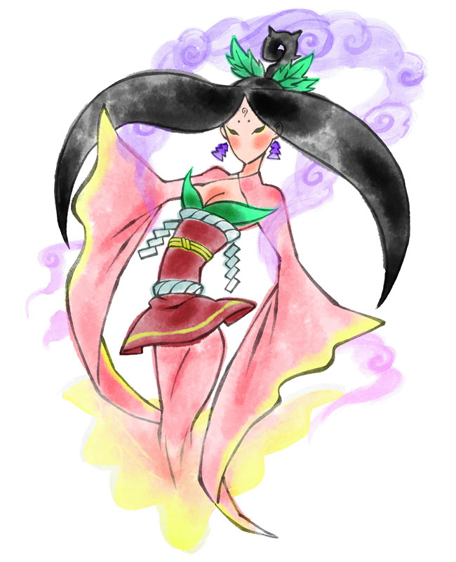 |  |
|:--:|:--:|
| *2D concept art: Sakuya, from Ōkami (Clover Studio / Capcom)* | *3D stylized scene in Unity* |

A watercolor-and-ink cherry tree shrine in Unity URP, styled after the concept art of Sakuya, the cherry tree spirit in Ōkami. Press **Space** in Play mode to switch between the tree in bloom and the withered tree. The sky runs through a full day and night on its own.

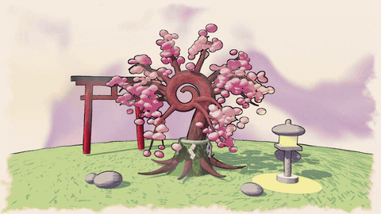

*Turnaround: one orbit, switching to withered and back, then sunset and nightfall. The full video continues through the night and back to day: [Images/turnaround.mp4](Images/turnaround.mp4)*

## Running it

- Unity 2022.3.9f1, URP 14.
- Open `Assets/Scenes/Shrine.unity` and set the Game view to 1920x1080 (the normal buffer is that size).
- Press Play. The camera orbits on its own and a day lasts 36 seconds; **Space** toggles bloom / withered.

## 1. Concept art

The style reference is the [Sakuya concept art](https://www.creativeuncut.com/gallery-03/oka-sakuya-01.html) from Ōkami (© Capcom, developed by Clover Studio; the game's artists are Kenichiro Yoshimura, Sawaki Takeyasu and Mari Shimazaki). What I tried to carry over:

- soft watercolor washes that pool darker at their edges and leave paper showing
- thin, tapered ink brush lines
- the palette: rose pink, crimson, leaf green, lilac clouds, a yellow glow, ink black
- the purple wash clouds behind the figure

Sakuya is the spirit of a cherry tree, so the scene is her tree. Its shape (spiral trunk, moss skirt, rope with paper streamers) follows the in-game tree, which has a [blossoming](https://www.creativeuncut.com/gallery-03/oka-cherry-tree-02.html) and a [withered](https://www.creativeuncut.com/gallery-03/oka-cherry-tree-01.html) form. Those two forms are what the Space key switches between.

| 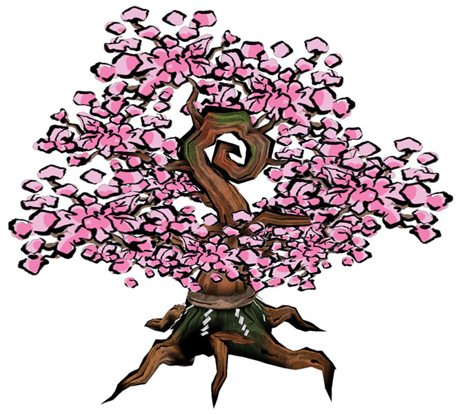 | 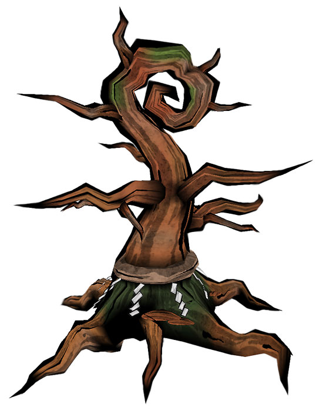 |
|:--:|:--:|
| *Reference: blossoming* | *Reference: withered* |

## 2. Surface shader: `Toon Ink`

Built on the three-tone toon graph from the lab. The new logic lives in Custom Function nodes backed by `Assets/Shaders/Includes/LightingHelp.hlsl`.

| 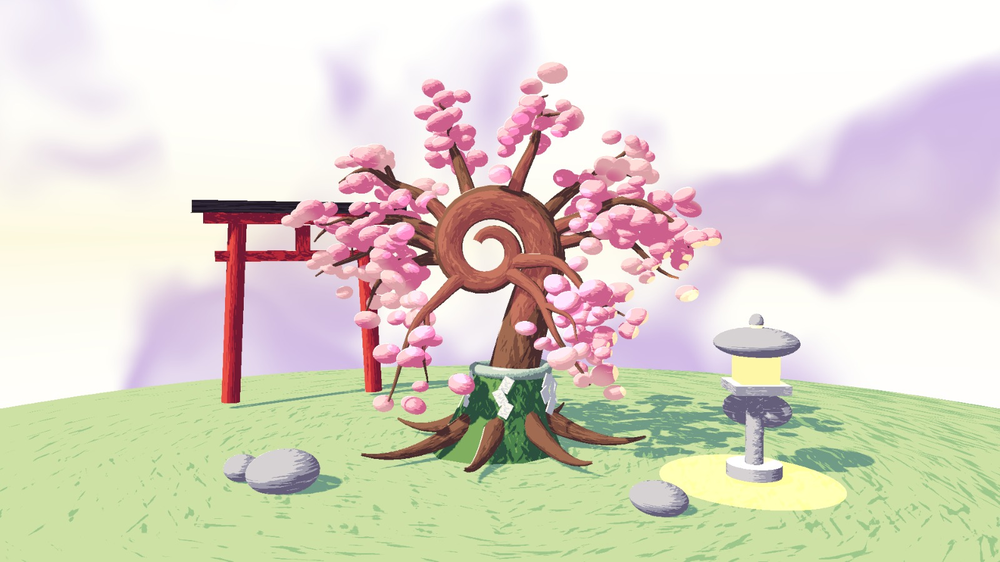 |
|:--:|
| *Surface shaders only, no post-processing* |

- **Multiple lights.** `InkLighting` calls the provided `ComputeAdditionalLighting` and ramps the extra lights with the same thresholds as the main light. The scene has a warm point light in the stone lantern (the yellow pool on the grass) and a pink one in the canopy.
- **Specular and rim.** A stepped Blinn-Phong highlight (`Specular Size`) and a rim that only appears on the lit side (`Rim Amount`). Both edges are anti-aliased with `fwidth`.
- **Shadow texture.** `Assets/Textures/Brush Shadow.png` is my own seamless texture of dry-brush strokes. It is painted by `Assets/Editor/BrushTextureBuilder.cs`: 560 tapered strokes with noise gaps, drawn with wrap-around so the texture tiles.
  - It is sampled with the object's UVs (Tiling And Offset on UV0), not screen position. `Shadow Scale` and `Shadow Rotation` are exposed per material.
  - `ShadowPattern` uses it to nudge the lighting value before the three-tone pick, so band edges and shadows break into strokes while fully lit areas stay clean.
  - Because it is in UV space the strokes follow the surface: along the trunk, around the rocks, across the grass.
- **Palette.** Each material has its own highlight / midtone / shadow colors picked from the concept art.

|  | 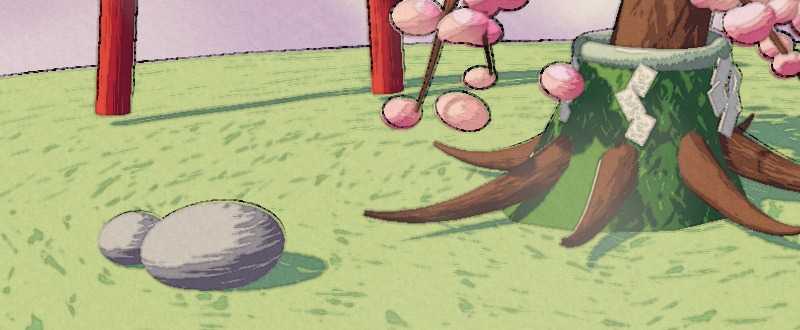 |
|:--:|:--:|
| *Shadow texture* | *Strokes following the UVs of the rocks, roots and ground* |

## 3. Special shader: `Toon Ink Special`

A variant of `Toon Ink` for the hero objects, the blossoms and the lantern flame. It adds both a vertex animation and an animated color.

- **Vertex animation (`InkSway`).** Each blossom bobs around its own pivot and puffs slightly, with a phase taken from its world position so no two move together. A `Bloom` value scales it from nothing to full size.
- **Animated color (`InkShimmer`).** Bands of a second color drift across the surface. Time is stepped with `floor` to 8 updates a second so it reads as redrawn frames; the band comes from `sin` and `smoothstep`.
- **Glow.** A `Glow` value swaps the lit color for the unlit highlight color, so the lantern flame stays bright at night.

## 4. Outlines: `Ink Outline`

- **Full Screen Feature fix.** The pass blitted the camera color into the temporary buffer through the material but never copied it back, so nothing reached the screen. I added the blit back.
- **Normal buffer.** The provided Normal Feature is added to the renderer with a `Hidden/Normal Copy` material and renders into `Assets/Buffers/Normal Buffer.renderTexture`.
- **Edge detection (`InkOutline` in `OutlineHelp.hlsl`).**
  - Sobel on linear eye depth, divided by the center depth so distant objects are not over-outlined. The threshold rises on surfaces seen at a grazing angle (read from the normal buffer), which keeps the ground from filling with lines.
  - Roberts cross on the normal buffer for interior edges.
  - Exposed: `Outline Color`, `Width`, `Depth Threshold`, `Normal Threshold`, `Wobble`, `Wobble FPS`, `Dry Brush`, `Border`.
- **Animated brush line.**
  - Depth edges are sampled through a noise-warped UV that is re-rolled `Wobble FPS` times a second, so the silhouette lines shake like redrawn frames.
  - The line width follows a slow "pressure" noise, and light strokes break up like a dry brush.
  - Normal edges are not warped, so the drawing keeps its structure.
  - Four sub-pixel taps soften the stair-steps of the depth buffer.
- The outline pass runs after the paper pass, so the ink sits crisp on top of the wash and stops at the paper margin.

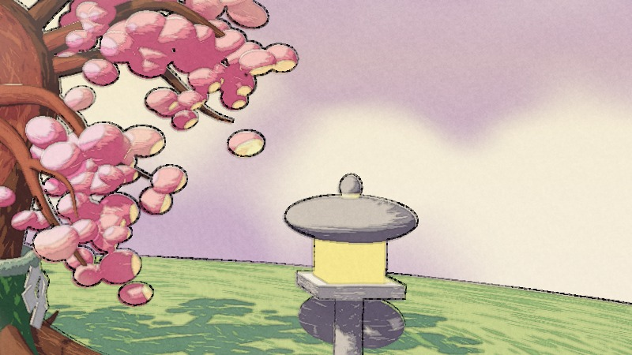

## 5. Post-process: `Paper Post`

A second Full Screen Feature that turns the frame into a watercolor on paper (`PaperWash` in `PostHelp.hlsl`):

- wobbly wash edges from sampling the frame through low-frequency noise
- pigment pooling: the color darkens where it changes quickly
- paper grain that shows more in the darker, more pigmented areas
- uneven wash density and a warm paper tint
- a rough unpainted paper border in place of a plain vignette

|  | 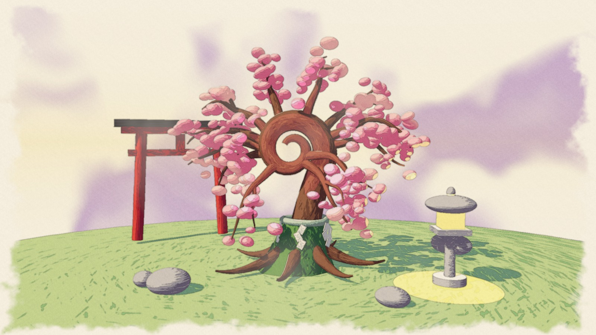 |  |
|:--:|:--:|:--:|
| *Surface shaders* | *+ paper wash* | *+ ink outlines* |

## 6. Scene

- **Cherry tree.** Generated by `Assets/Editor/CherryTreeBuilder.cs` (Tools > Build Cherry Tree). The spiral trunk, branches, roots, moss skirt and rope are tubes swept along curves, with V following the path length so the shadow texture keeps one scale. The 273 blossoms are squashed spheres scattered along the branches.
- **Everything else** (torii gate, stone lantern, rocks, hill) is Unity primitives.
- **Lights.** One directional light (the sun, or the moon at night) and two point lights.

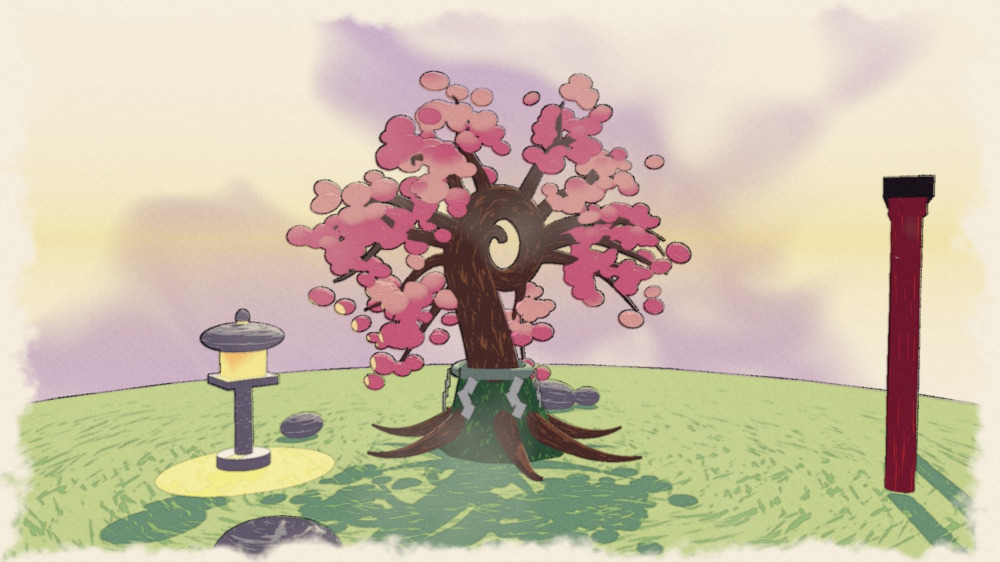

## 7. Interactivity

**Space** switches between bloom and withered, after the two forms of the reference tree. Two scripts listen for it:

- `MaterialSwapper` sits on 19 objects and swaps each to a material that uses a different surface shader, `Ink Wash`. It runs the same toon lighting and then turns the result into ink on paper: its brightness picks a value between an ink color and a paper color (`SumiWash`), so the three toon tones become three ink values.
- `WitherToggle` fades a global `_Wither` value from 0 to 1 over 1.5 seconds. The shaders read it:
  - blossoms close one by one in the vertex shader
  - in the sky, the clouds turn into heavy ink blots and the glow goes out
  - the paper pass drains the remaining color
  - the outline gets thicker and shakier

|  | 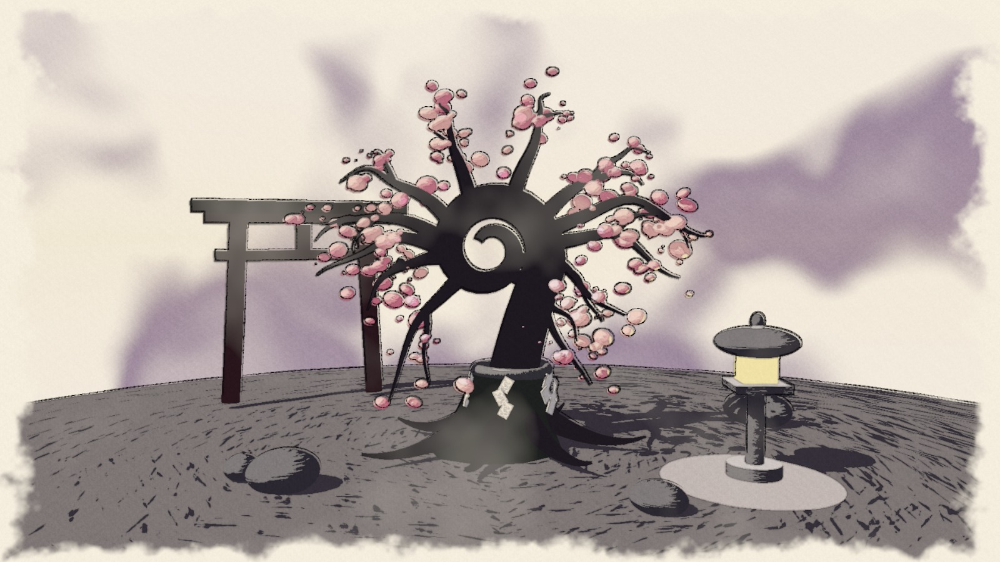 | 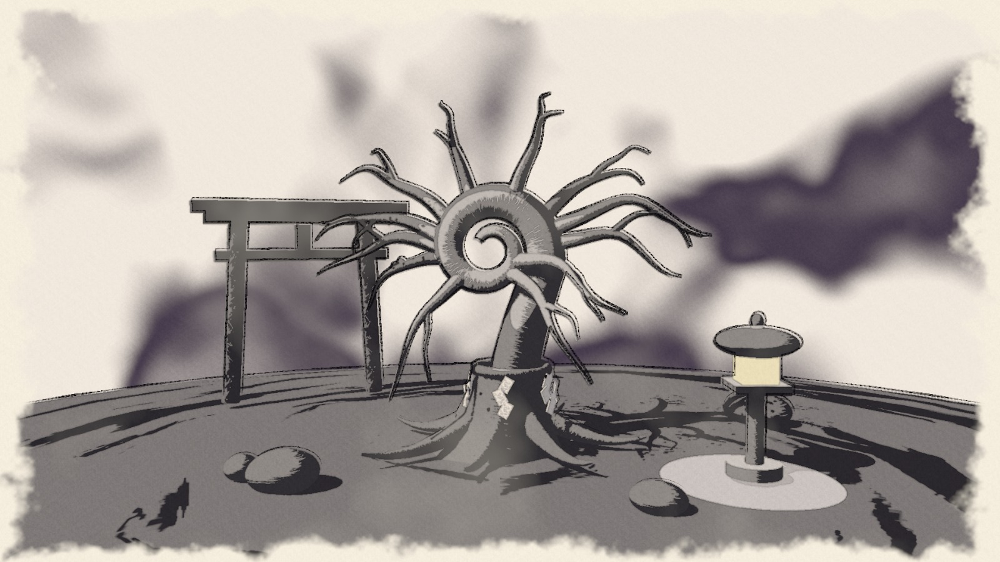 |
|:--:|:--:|:--:|
| *Bloom* | *Halfway* | *Withered* |

|  |  |
|:--:|:--:|
| *Reference: withered tree* | *Withered mode* |

## 8. Extra credit: custom skybox and day-night cycle

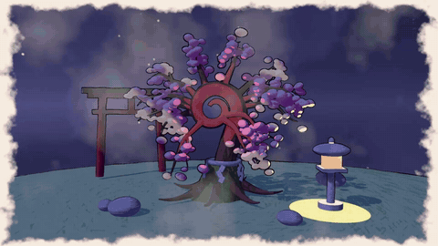

*Second orbit of the video: night, dawn and back to day.*

- **Custom skybox (`Wash Sky`, `WashSky` in `SkyHelp.hlsl`).** A watercolor sky painted on the view direction:
  - wash clouds with a darker pigment rim, drifting slowly; the noise is 3D so the sky has no seam
  - a glow along the horizon that leans toward the sun or moon
  - a soft disc for the sun or moon, drawn where the main light is
  - splattered stars that fade in at night
- **Day-night cycle (`DayNightCycle.cs`).** One day lasts 36 seconds.
  - The directional light follows the sun's arc; below the horizon it becomes the moon, rising from the opposite side.
  - The light color and the sky's colors blend between three looks (day, dusk, night) that are editable in the Inspector.
  - While the sun or moon sits on the horizon the direct light fades out (a global `_SunDim` read by `GetMainLight`), which hides the switch between them and gives a silhouette at sunset.
  - The lantern's point light gets brighter at night.

| 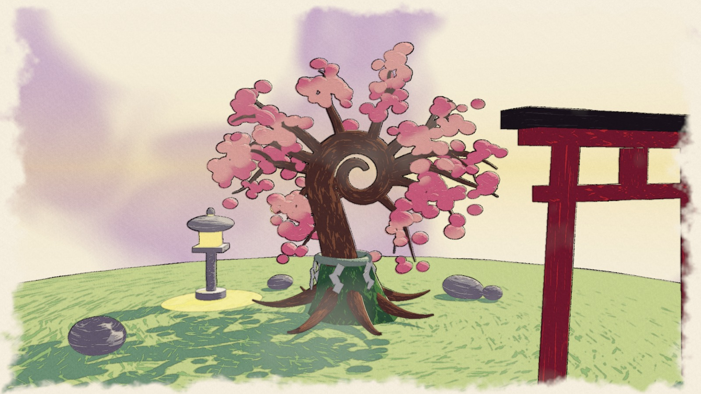 | 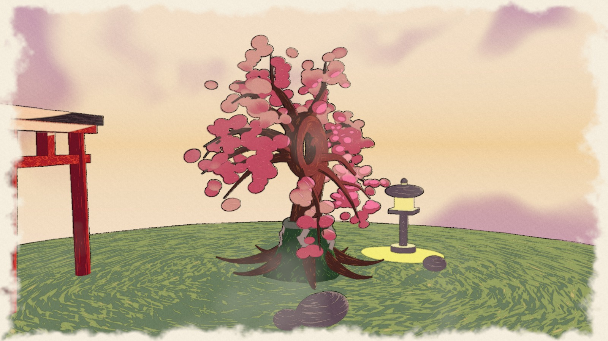 | 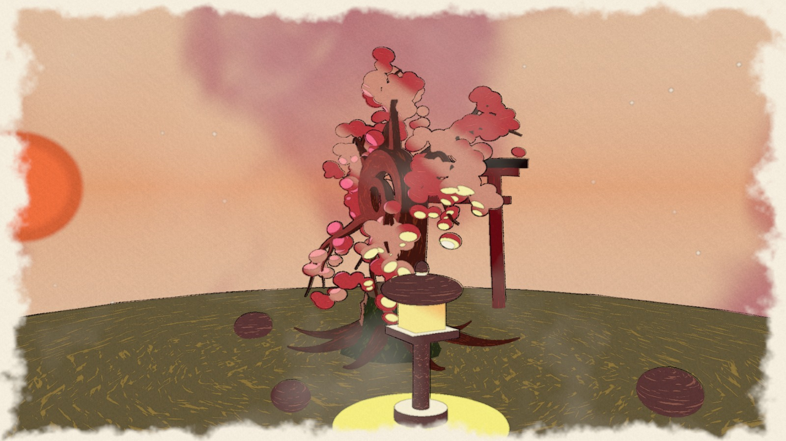 |
|:--:|:--:|:--:|
| *Day, looking toward the sun* | *Dusk* | *Sunset* |

| 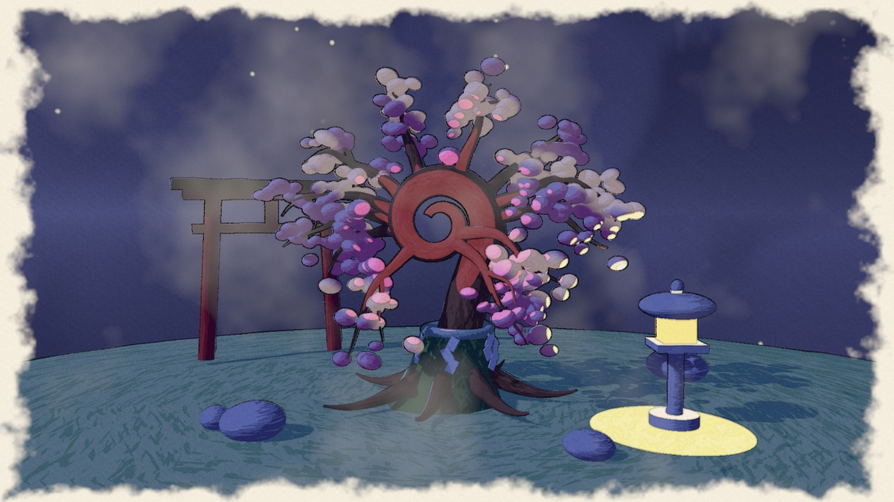 | 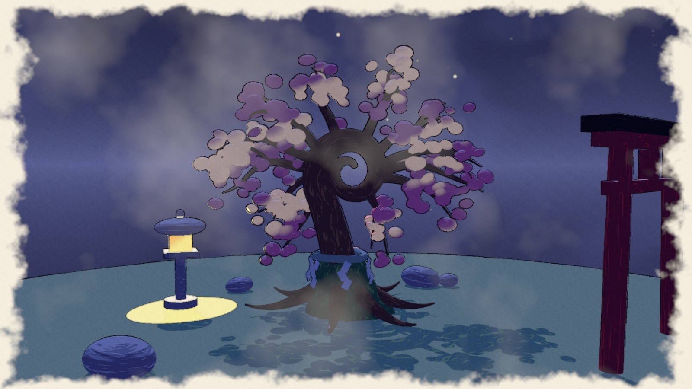 |
|:--:|:--:|
| *Night* | *Midnight, from behind* |

## Files

| Path | What it is |
|---|---|
| `Assets/Shaders/Toon Ink.shadergraph` | surface shader |
| `Assets/Shaders/Toon Ink Special.shadergraph` | blossoms and lantern flame |
| `Assets/Shaders/Ink Wash.shadergraph` | surface shader for the withered mode |
| `Assets/Shaders/Ink Outline.shadergraph` | outline pass |
| `Assets/Shaders/Paper Post.shadergraph` | paper pass |
| `Assets/Shaders/Wash Sky.shadergraph` | skybox |
| `Assets/Shaders/Includes/*.hlsl` | the functions the graphs call |
| `Assets/Scripts/MaterialSwapper.cs`, `WitherToggle.cs` | interactivity |
| `Assets/Scripts/DayNightCycle.cs` | day-night cycle |
| `Assets/Editor/CherryTreeBuilder.cs`, `BrushTextureBuilder.cs` | tree and shadow texture generators |

## References

- Concept art: Ōkami, © Capcom / Clover Studio, via [Creative Uncut](https://www.creativeuncut.com/art_okami_a.html)
- [Alexander Ameye, Edge Detection Outlines](https://ameye.dev/notes/edge-detection-outlines/)
- [Roystan, Toon Shader](https://roystan.net/articles/toon-shader/) for the rim light gated by N·L
- Course lab, base code and tutorial videos
